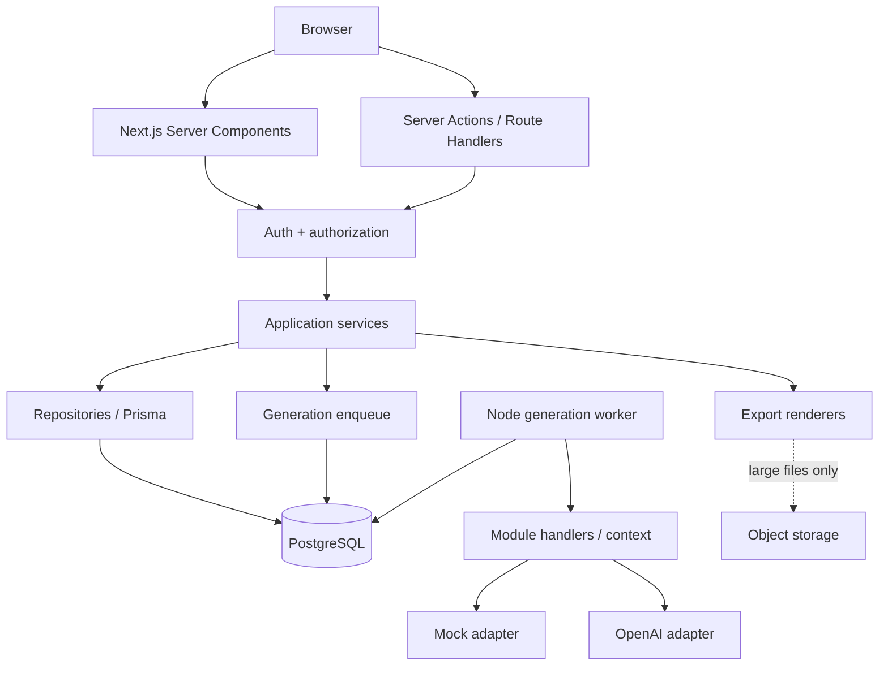

# Application Containers

```mermaid
flowchart TD
  Browser --> RSC["Next.js Server Components"]
  Browser --> MUT["Server Actions / Route Handlers"]
  RSC --> AUTH["Auth + authorization"]
  MUT --> AUTH
  AUTH --> SVC["Application services"]
  SVC --> REPO["Repositories / Prisma"]
  REPO --> PG[("PostgreSQL")]
  SVC --> EX["Export renderers"]
  SVC --> Q["Generation enqueue"]
  Q --> PG
  Worker["Node generation worker"] --> PG
  Worker --> MOD["Module handlers / context"]
  MOD --> MOCK["Mock adapter"]
  MOD --> OAI["OpenAI adapter"]
  EX -. large files only .-> OBJ["Object storage"]
```

Route/UI never imports Prisma or AI adapters directly. Worker and application share contracts/domain code, not process memory.
