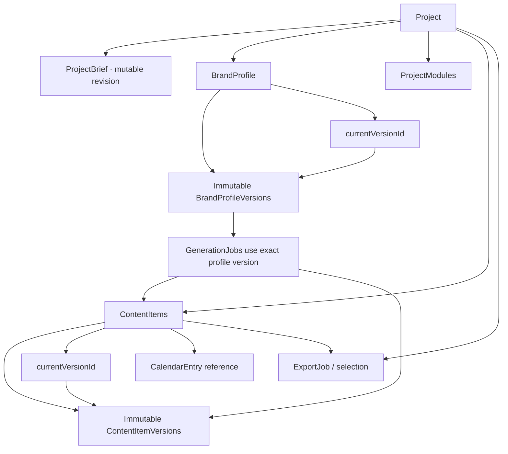

# Project Data Flow

```mermaid
flowchart TD
  P["Project"] --> B["ProjectBrief · mutable revision"]
  P --> BP["BrandProfile"]
  BP --> BPV["Immutable BrandProfileVersions"]
  BP --> CURP["currentVersionId"]
  CURP --> BPV
  P --> PM["ProjectModules"]
  P --> CI["ContentItems"]
  CI --> CIV["Immutable ContentItemVersions"]
  CI --> CURC["currentVersionId"]
  CURC --> CIV
  BPV --> J["GenerationJobs use exact profile version"]
  J --> CI
  J --> CIV
  CI --> CE["CalendarEntry reference"]
  P --> EJ["ExportJob / selection"]
  CI --> EJ
```

Calendar never duplicates content bodies. Existing content retains its original Brand Profile version after a profile change.
